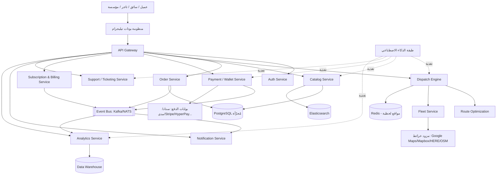

# الوثيقة الهندسية الموحدة النهائية
## أمر تنفيذي شامل للوكيل الهندسي — منصة "وُصلة" اللوجستية الذكية

**حالة الوثيقة:** نسخة نهائية مدمجة من جميع الأوامر والوثائق السابقة (التقرير المعماري الأول، التوجيه المؤسسي Enterprise Engineering Directive، مواصفة بناء المنصة التفصيلية، والمسودة الهندسية الموحدة الأولى). تم حذف كل تكرار، وحل كل تعارض بقرار موثّق (انظر القسم الأخير "ملاحظات الدمج وحل التعارضات"). **اعتبر هذه الوثيقة وحدها هي مصدر الحقيقة الوحيد من الآن فصاعداً، وتجاهل أي صياغة سابقة تتعارض معها.**

لا يوجد إطار زمني مفروض على أي مرحلة. لا توجد لغة برمجة أو إطار عمل مفروض عليك. اختر التقنية المناسبة بنفسك بناءً على الأدلة والتحليل، ووثّق سبب اختيارك. لديك الحرية الكاملة في القرار الهندسي، بشرط الالتزام الصارم بالقواعد الإلزامية الواردة في هذه الوثيقة.

---

## 0. المرحلة الصفرية الإلزامية — التحليل الشامل للمشاريع المرفقة (بوابة حظر Blocking Gate)

**هذه المرحلة إلزامية وغير قابلة للتخطي. لا يجوز البدء بأي سطر كود، أي تصميم نهائي، أو أي بناء فعلي قبل إنهاء هذه المرحلة بالكامل وعرض نتائجها.**

### 0.1 فك واستخراج الملفات
- فك ضغط **جميع** ملفات ZIP المرفوعة دون استثناء، مهما كان عددها أو حجمها.
- استخراج الشجرة الكاملة لكل مشروع: كل مجلد، كل ملف، بما في ذلك الملفات المخفية، ملفات الإعداد، ملفات البيئة، ملفات القفل (lock files)، وملفات التوثيق.
- لا تفترض أن أي ملف أو مشروع "مكرر" أو "غير مهم" إلا بعد فحصه فعلياً وفتح محتواه.

### 0.2 التحليل الدقيق على مستوى الكود (Line-by-Line / Symbol-Level Analysis)
لكل مشروع مستخرج، نفّذ تحليلاً دقيقاً وحرفياً يشمل:
- **قراءة كل ملف كود مصدري سطراً بسطر**، دون تخطي أي ملف مهما بدا ثانوياً.
- استخراج **كل كلاس (Class)** المعرّف، وعلاقاته بالوراثة والتركيب.
- استخراج **كل دالة/تابع (Function/Method)** المعرّف: اسمه، مدخلاته، مخرجاته، وما يقوم به فعلياً (وليس فقط اسمه).
- تتبّع **كل استدعاء (Call)** بين الدوال والكلاسات والخدمات، لبناء خريطة استدعاءات (Call Graph) لكل مشروع.
- استخراج **كل رمز (Symbol)**: متغيرات عامة، ثوابت، Enums، أنواع بيانات مخصّصة، Interfaces.
- تحليل **كل ملف تهيئة/إعداد**: ملفات env، ملفات config، ملفات docker/compose، ملفات CI.
- تحليل **كل استيراد/تبعية (Import/Dependency)** ومكتبات الطرف الثالث المستخدمة في كل مشروع، ولماذا استُخدمت.
- تحليل **كل مسار API / Endpoint / Route** المعرّف: الطريقة (HTTP Method)، المدخلات، المخرجات، طبقة الحماية المطبّقة عليه.
- تحليل **كل جدول/مخطط قاعدة بيانات (Schema/Model)**: الحقول، العلاقات، الفهارس، القيود.
- تحليل **كل شاشة/واجهة مستخدم** إن وُجدت (ويب أو بوت): تدفق الشاشات، الأزرار، الحالات.
- تحليل **كل تدفق عمل (Workflow)** ومنطق عمل (Business Logic) مطبّق فعلياً في الكود، وليس فقط الموثّق في تعليقات أو README.

### 0.3 أبعاد التحليل الإلزامية (يجب توثيق كل بُعد لكل مشروع على حدة)
1. تحليل هيكل المشروع (بنية المجلدات والتنظيم العام).
2. تحليل جميع المجلدات ووظيفة كل مجلد.
3. تحليل جميع الملفات ودور كل ملف.
4. تحليل الأكواد (منطقياً ووظيفياً).
5. تحليل قواعد البيانات (النماذج، العلاقات، سياسات التخزين).
6. تحليل الـ APIs (التصميم، الاتساق، التوثيق الذاتي).
7. تحليل الخدمات (حدودها، مسؤولياتها، تداخلها).
8. تحليل البنية المعمارية الحالية لكل مشروع.
9. تحليل واجهات المستخدم (بوتات/ويب).
10. تحليل تدفقات العمل (Workflows) من البداية للنهاية.
11. تحليل المنطق التجاري (Business Logic) الفعلي المطبّق.
12. تحليل نقاط القوة في كل مشروع.
13. تحليل نقاط الضعف والثغرات الهندسية.
14. تحليل قابلية إعادة الاستخدام لكل مكوّن.
15. تحليل التكرار (بين المشاريع، وداخل المشروع الواحد).
16. تحليل التعارضات (بين قرارات مشروع وآخر).
17. تحليل جودة الكود (قابلية القراءة، الاتساق، الالتزام بمعايير هندسية).
18. تحليل الأداء (نقاط الاختناق المحتملة، الاستعلامات الثقيلة، التصميم غير القابل للتوسع).
19. تحليل الأمان (ثغرات، تسريبات محتملة، غياب تحقق أو تشفير).
20. تحليل قابلية التوسع لكل مكوّن.

### 0.4 التقرير الهندسي الداخلي المطلوب (مخرج إلزامي قبل أي تطوير)
أنتج تقريراً موثقاً يتضمن:
- أسماء جميع المشاريع المكتشفة ووصف موجز لكل منها.
- مكونات كل مشروع (خدمات، بوتات، لوحات تحكم، قواعد بيانات، تكاملات).
- قائمة كاملة بكل الميزات المستخرجة من كل مشروع.
- الميزات **المكررة** عبر المشاريع (مع تحديد أفضل تنفيذ لها).
- الميزات **الفريدة** في كل مشروع (غير الموجودة في غيره).
- أفضل الأجزاء القابلة للدمج مباشرة في المنصة الموحدة.
- المشاكل، النواقص، والثغرات المكتشفة في كل مشروع.
- تقييم صريح لجودة الكود، الأداء، الأمان، وقابلية التوسع لكل مشروع.

### 0.5 بناء خريطة معرفية موحدة (Knowledge Graph)
- ابنِ رسماً بيانياً معرفياً يربط جميع المشاريع ببعضها: أي الكيانات مشتركة (مستخدم، طلب، سائق، متجر...)، أي المنطق متشابه، أي التصميمات متعارضة، وأي الخدمات يمكن أن تُدمج في خدمة واحدة موحدة.
- استخدم هذه الخريطة كمرجع أثناء بناء المواصفة الموحدة في الأقسام التالية، وأثناء التنفيذ الفعلي لاحقاً.

**فقط بعد اكتمال هذه المرحلة (0.1 → 0.5) وعرض التقرير، يُسمح بالانتقال إلى مرحلة التصميم والبناء الموصوفة في بقية هذه الوثيقة.**

---

## 1. دور الوكيل ونمط العمل

اعمل كفريق هندسي متكامل واحد، لا كأفراد منفصلين، بحيث تتقمّص في آنٍ واحد أدوار:
Chief Software Architect، Principal Software Engineer، Distributed Systems Architect، Cloud Infrastructure Architect، Database Architect، DevOps Architect، Security Architect، AI Systems Architect، Product Architect، UX Architect، Backend Engineers، Frontend Engineers، Telegram Platform Engineers، QA Engineers، Performance Engineers، SRE Engineers، بالإضافة إلى مهندس منتج، محلل أعمال، ومدير منتج.

كل قرار يصدر يجب أن يعكس اتساقاً بين كل هذه الأدوار مجتمعة، لا قرارات متضاربة من زوايا منفصلة.

---

## 2. الرؤية والهدف الاستراتيجي

بناء منصة لوجستية عالمية تعمل كوسيط ذكي وشامل، تُغني جميع الأطراف (أفراد، سائقين، متاجر، مطاعم، موردين، مخازن، مؤسسات، سلاسل تجارية، شركات كبرى، جهات حكومية) عن الاعتماد على الشركات اللوجستية التقليدية المنعزلة.

تربط المنصة بشكل مباشر وآمن بين طالبي الخدمة ومقدّميها، عبر واجهة محادثية أساسية قائمة على بوتات تيليجرام كطبقة تشغيل رئيسية — **وليست تطبيقاً تقليدياً**، بل **منصة تشغيل لوجستي عالمي**، مصممة بحيث يمكن إضافة أي قناة مستقبلية (تطبيق جوال، ويب، واتساب...) دون إعادة كتابة النظام من الصفر.

الهدف النهائي: تمكين أي جهة (فرد أو مؤسسة) من إدارة كامل عملياتها اللوجستية — توصيل، مشاوير، حجوزات، شحن، إدارة أسطول — من خلال منصة واحدة، بتجربة مستخدم عربية سلسة، ونموذج اشتراكات عادل ومحفّز، وبنية قادرة على خدمة أكثر من **مليار مستخدم**.

---

## 3. نطاق المنصة والأطراف المتصلة

المنصة سوق لوجستي متعدد الأطراف (Multi-Sided Marketplace) يربط بين:

| الطرف | الوصف |
|---|---|
| العميل النهائي | أفراد يطلبون توصيل، مشاوير، أو شراء منتجات/خدمات. |
| السائق المستقل | يقدّم خدمات التوصيل و/أو المشاوير (اختيار: مشاوير فقط / توصيل فقط / كليهما). |
| المتجر / المطعم / البائع الفردي | منشأة أو فرد يعرض منتجاته أو قوائم طعامه أو خدماته. |
| المورّد (Supplier) | جهة توريد بضائع بالجملة تتعامل مع متاجر/مطاعم/مؤسسات عبر المنصة. |
| المخزن (Warehouse) | نقطة تخزين/تجميع تدخل ضمن تدفقات الشحن والاستلام والتوزيع. |
| المؤسسة / السلسلة التجارية | كيان متعدد الفروع يحتاج إدارة مركزية، صلاحيات متعددة، وأسطولاً خاصاً محتملاً. |
| الشركة الكبرى | تحتاج تكاملاً مع أنظمتها الداخلية (ERP، WMS، CRM، POS) واتفاقيات مستوى خدمة (SLA). |
| موظفو التوصيل وسائقو الشركات | أسطول داخلي تابع لمؤسسة أو شركة، يُدار عبر بوتات وصلاحيات مخصّصة. |
| شركات النقل ومزوّدو الخدمات اللوجستية | جهات نقل، مستودعات، أو أي طرف يرغب بعرض خدماته اللوجستية عبر المنصة. |
| أي فرد أو جهة أخرى | يريد عرض بضاعته أو خدمته، أو إدارة طلبات/توصيل/حجوزات/مشاوير/أسطول عبر المنصة (السوق المفتوح). |

---

## 4. حالات الاستخدام الشاملة

يجب أن تدعم المنصة كل ما يلي دون استثناء:

**طلبات المنتجات والخدمات:** طلب منتج، طلب طعام، طلب أي سلعة من أي مكان (سوق مفتوح)، طلب بقالة، طلب طرود، طلب خدمة عند الطلب.

**طلبات النقل:** طلب مشوار (خاص/عائلي/يومي/مؤقت/شهري)، طلب سائق، طلب مندوب.

**الشحن والتخزين:** شحن، استلام، توصيل بين المستودعات، إدارة توزيع من مخزن لفرع.

**الجدولة والاشتراك:** جدولة مسبقة، حجوزات مسبقة، اشتراك شهري، اشتراك مؤقت.

**أنماط الطلب:** طلبات فورية، طلبات مستقبلية، طلبات جماعية (Bulk)، طلبات مؤسسات، طلبات شركات، **طلبات حكومية**، طلبات أفراد.

**تشغيل الأساطيل:** تشغيل سائقي المحال والمطاعم الخاصين، تشغيل سائقي الشركات، إدارة أسطول خاص كامل (هجين مع سائقي المنصة عند الحاجة)، توصيل داخلي للمؤسسات.

---

## 5. واجهة النظام: منظومة بوتات تيليجرام كطبقة تشغيل أساسية

الواجهة الأساسية للمنصة في مرحلتها الأولى **ليست تطبيق جوال تقليدي**، بل منظومة بوتات تيليجرام محادثية، عربية أولاً وقابلة للتوسع لأي لغة، تعمل كطبقة التشغيل الرئيسية للنظام بالكامل. صمّم النظام بحيث يمكن إضافة أي قناة مستقبلية (تطبيق جوال، واتساب، ويب) بإعادة استخدام نفس طبقة الخدمات الخلفية دون أي إعادة كتابة.

### 5.1 البوتات الإلزامية (14 بوتاً موحّداً)

| # | البوت | المستخدم | الوظائف الرئيسية |
|---|---|---|---|
| 1 | بوت العميل | الأفراد | البحث، الطلب، التتبع، الدفع، الشكاوى. |
| 2 | بوت السائق | السائقون (مشاوير/توصيل/كليهما) | استقبال المهام، الملاحة، إدارة الأرباح، الاشتراك. |
| 3 | بوت التاجر (متجر/مطعم/بائع فردي) | المتاجر والمطاعم والبائعون | إدارة الكتالوج، الطلبات، الفروع، العروض. **(يستوعب وظائف "بوت المطعم" المنفصل سابقاً لتطابق منطق الكتالوج والطلبات بين الحالتين)** |
| 4 | بوت المؤسسة/الشركة | الشركات والسلاسل | إدارة فروع، موظفين، أسطول، تقارير، تكامل API. |
| 5 | بوت الأسطول | مديرو الأساطيل الداخلية | تتبع السائقين التابعين، توزيع المهام، تحليلات الأداء. |
| 6 | بوت الإدارة العليا | المدراء التنفيذيون | مؤشرات أداء، تقارير مالية، قرارات استراتيجية. |
| 7 | بوت الدعم والتذاكر | فريق الدعم | إدارة التذاكر، الشكاوى، النزاعات، التواصل بين الأطراف. |
| 8 | بوت المندوبين (يشمل المناديب الميدانيين وحالات الكوريير الخاصة) | المندوبون الميدانيون | إدارة المهام، تحديث الحالة، المسح الميداني. |
| 9 | بوت المشرفين | المشرفون التشغيليون | مراقبة السائقين، التدخل في الطلبات، إدارة المناطق. |
| 10 | بوت العمليات | فريق العمليات | مراقبة حيّة للطلبات، إعادة توجيه، إدارة أوقات الذروة. |
| 11 | بوت المرسِل (Dispatcher) | موظفو التوزيع | توزيع يدوي أو شبه آلي للطلبات عند الحاجة (تدخل بشري احتياطي على المحرك الآلي). |
| 12 | بوت التحليلات | مدراء البيانات | استعلامات ذكية، تنبؤات، تقارير مخصّصة عند الطلب. |
| 13 | بوت الشحن والاستلام | مزوّدو الشحن والمخازن | إدارة الشحنات، التتبع، تسليم/استلام المستودعات. |
| 14 | بوت السوق المفتوح | الباعة الأفراد | عرض بضائع، استقبال طلبات، إدارة مبيعات فردية. |

### 5.2 خصائص تصميم البوتات الموحّدة
- **تجربة محادثة عربية بالكامل**: أزرار مضمّنة (Inline Keyboards)، قوائم ديناميكية، أوامر مختصرة (مثل: `/طلب`، `/مشوار`، `/تتبع`).
- **دعم الوسائط**: مشاركة الموقع الجغرافي، الصور، التوقيع الإلكتروني، إثبات التسليم.
- **إشعارات فورية (Push)** عند كل تغيّر في حالة الطلب، وصول السائق، انتهاء الاشتراك، أو حدوث مشكلة.
- **صلاحيات إدارية داخل بوتات المؤسسات**: إضافة/حذف سائق، تحديث الكتالوج، مراجعة الطلبات، تقارير أداء.
- **إمكانية تخصيص بوتين أو أكثر لكل مؤسسة**: بوت عملاء، بوت سائقين، وبوت إدارة عند الحاجة، مع خيار وسم بالعلامة التجارية الخاصة (White-Label) للعملاء الكبار.
- **التكامل الخلفي**: كل بوت يتصل عبر Webhook أو Polling مع API Gateway موحّد؛ إدارة جلسات وسياق لكل مستخدم لضمان استمرارية الحوار؛ توثيق ثنائي (OTP) عبر تيليجرام أو SMS.
- **قابلية تشغيل عدد ضخم من نسخ البوتات في وقت واحد**، عبر معمارية توزّع أحمال الـ Webhooks على طبقة عمّال (Workers) مستقلة عن منطق الخدمات، بحيث لا يشكّل عدد البوتات عنق زجاجة.
- **حماية البوتات ذاتها**: تحديد معدّل الاستخدام لكل مستخدم/بوت (Rate Limiting)، وحماية من إساءة الاستخدام والسبام على مستوى طبقة البوت قبل وصول الطلب للخدمات الخلفية.

---

## 6. الوظائف التفصيلية لكل طرف

### 6.1 العميل
التسجيل والتحقق عبر رقم الجوال (OTP) · إدارة الملف الشخصي · تحديد الموقع الحالي أو عناوين محفوظة متعددة · بحث ذكي بلغة طبيعية عن أي سلعة أو خدمة (حتى مع وصف غير دقيق) · تصفح المتاجر والمطاعم والمؤسسات القريبة · طلب منتج من كتالوج متجر/مطعم/بائع فردي · إنشاء طلب خاص غير موجود في الكتالوج · طلب توصيل من نقطة إلى نقطة · طلب مشوار (خاص/عائلي/يومي/مؤقت/شهري) · جدولة المشاوير مسبقاً · تتبع الطلب أو السائق مباشرة على الخريطة داخل البوت · تواصل آمن مع السائق (نص/صوت مع إخفاء الرقم الحقيقي) · الدفع (نقداً، إلكترونياً، أو بالمحفظة الداخلية) · عرض الفاتورة الإلكترونية · تقييم السائق والمتجر والطلب · إعادة الطلب السابق بنقرة واحدة · إدارة الشكاوى والاسترداد · استقبال إشعارات لحظية عبر تيليجرام.

### 6.2 السائق
**التسجيل والتوثيق (KYC):** رفع صورة الهوية الوطنية/الإقامة، رخصة القيادة سارية، صورة المركبة والتأمين والفحص الفني، شهادة خلوّ سوابق عند الحاجة. تحقق تلقائي من الوثائق (OCR/ML) أو مراجعة يدوية. **تحقق وجه (Face Verification) عند كل تسجيل دخول** لمنع انتحال الهوية. ربط السائق بمنصة "مساند" أو أنظمة وزارة الموارد البشرية لتوثيق العقود والرواتب إلكترونياً. تفعيل السائق بعد اجتياز الفحص مع إشعار فوري عبر البوت.

**التشغيل اليومي:** اختيار نوع النشاط (مشاوير فقط / توصيل فقط / كليهما) · إدارة حالة التوفر (متصل، غير متصل، مشغول، في رحلة) · استقبال الطلبات وفق خوارزمية المطابقة الذكية · قبول أو رفض الطلب وفق سياسات عادلة · عرض تفاصيل الطلب (المسافة، الأجر المتوقع، المسار) · الملاحة إلى المتجر أو العميل · تحديث حالة الطلب عبر دورة كاملة: تم القبول ← في الطريق للاستلام ← تم الاستلام ← في الطريق للعميل ← تم التسليم ← مكتمل / ملغي.

**الإدارة المالية والدعم:** لوحة أرباح وطلب سحب · إدارة الاشتراك وحالته مع تنبيهات انتهاء · إدارة المخالفات والتنبيهات · نظام تقييم ونظام حوافز · سجل رحالت وطلبات كامل · دعم فني مباشر عبر البوت.

### 6.3 المتجر / المطعم / البائع
إنشاء حساب ورفع الوثائق (السجل التجاري، شهادة ضريبة القيمة المضافة، إثبات العنوان) · إدارة صلاحيات المستخدمين (مالك، مدير، موظف توصيل) · تحديد نوع الاشتراك حسب حجم العمل وعدد الفروع وحجم الكتالوج · استقبال وإدارة الطلبات (مقبول، قيد التحضير، جاهز) · ربط الطلبات بسائقي المنصة أو سائقين خاصين بالمنشأة · لوحة مبيعات وتقارير أداء وإدارة عروض/خصومات · تكامل مع أنظمة نقاط البيع (POS) عبر API للسلاسل الكبيرة.

### 6.4 المؤسسة / الشركة / السلسلة التجارية
حساب هرمي: شركة ← فروع ← مستخدمون ← سائقون · تخصيص بوتات داخلية (عملاء/سائقين/إدارة) بعلامة تجارية خاصة عند الحاجة · إدارة أسطول خاص كامل أو هجين (أسطول داخلي + سائقو المنصة) · تحكّم دقيق بالصلاحيات (RBAC) حسب الدور (مدير فرع، موظف توصيل، محاسب) · إدارة الاشتراكات والفواتير · تقارير تشغيلية ومالية وأداء سائقين على مستوى الفرع أو المؤسسة، قابلة للتصدير · واجهات API للتكامل مع CRM وWMS وERP · مستويات خدمة (SLA) قابلة للتخصيص حسب الباقة.

## 7. نظام الكتالوج وإدارة المخزون

نفّذ نظام كتالوج شامل يدعم: إضافة المنتجات (اسم، وصف، سعر، صور، كمية متاحة) · التصنيفات والعروض والخصومات وأوقات التوفر · خيارات المنتج وإضافات المطاعم (Modifiers/Add-ons) · إدارة المخزون حسب الفرع · الضرائب والرسوم لكل منتج · حالة المنتج (متاح/غير متاح/مخفي) · مزامنة الكتالوج مع أنظمة POS/ERP للمؤسسات الكبيرة عبر API · استيراد الكتالوج دفعة واحدة (CSV/Excel/API) · تحديث المخزون تلقائياً عند تنفيذ الطلبات · بحث ذكي عن السلع (حتى مع وصف غير دقيق من العميل، عبر طبقة الذكاء الاصطناعي) · اقتراح أقرب فرع/متجر يملك السلعة المطلوبة للعميل تلقائياً.

## 8. السوق المفتوح (Marketplace)

أي فرد أو مؤسسة يمكنه عرض بضاعته أو خدماته عبر البوت، مع تحديد الفئة والسعر والموقع وصور المنتج. يدعم النظام: بحثاً متقدماً (فئة/موقع/سعر/تقييم) · طلب التوصيل أو الحجز مباشرة من نتائج السوق المفتوح · نظام تقييم وتعليقات للمشترين والبائعين · إدارة نزاعات واحتيال عبر نظام شكاوى مدمج مرتبط بنظام مكافحة الاحتيال الموحّد (القسم 17).

## 9. محرك المطابقة والتوزيع الذكي (Dispatch Engine)

محرك التوزيع هو قلب المنصة التشغيلي، ويُبنى كخدمة مستقلة تماماً (Standalone Service)، ويجب أن يدعم جميع أوضاع الطلب (توصيل، مشاوير، حجوزات، طلبات مؤسسات) والتكيّف مع تغيرات السوق (أوقات الذروة، الطلب المفاجئ).

### 9.1 عوامل الإسناد
قرب السائق من العميل · قرب السائق من المتجر · نوع الطلب · نوع مركبة السائق · حالة السائق · تقييم السائق · نسبة قبول السائق · ازدحام المنطقة · وقت التحضير المتوقع في المتجر/المطعم · أولوية الباقة/الاشتراك **كعامل ثانوي محدود الوزن فقط، بشرط عدم الإخلال بمبدأ منع الاحتكار والعدالة بين السائقين** · تقليل زمن الانتظار الكلي · تقليل تكلفة التشغيل · دعم إعادة التوجيه الفوري عند رفض الطلب أو انتهاء المهلة · دعم الطلبات المجدولة والمتكررة (شهرية/يومية).

### 9.2 خوارزميات الإسناد (تُبنى تصاعدياً، الأحدث لا يلغي الأقدم بل يضيف عليه)
- **الإسناد القريب (Greedy Matching):** تخصيص الطلب لأقرب سائق متاح فقط — يُستخدم كاحتياط (Fallback) وفي الأحمال المنخفضة.
- **الإسناد المثالي الدُفعي (Batched Bipartite Matching):** تجميع الطلبات والسائقين ضمن نافذة زمنية (2–5 ثوانٍ)، بناء مصفوفة تكلفة (ETA، المسافة، التقييم)، ثم تطبيق خوارزمية Hungarian Algorithm لإيجاد الإسناد الأمثل على مستوى النظام بالكامل. يقلّل هذا النهج زمن الانتظار الكلي بشكل ملموس (مرجعياً حتى ~22% مقارنة بالإسناد القريب) — يُستخدم كوضع تشغيل افتراضي.
- **الإسناد الذكي بالذكاء الاصطناعي:** نماذج تعلّم آلي تحلّل بيانات تاريخية وحيّة (الطلب، حركة المرور، أداء السائقين) لتوقّع التأخيرات، وإعادة توزيع الأسطول استباقياً، والتكيّف مع مواسم الذروة والأحداث الاستثنائية — يُفعَّل تدريجياً فوق طبقة المطابقة الدُفعية.

### 9.3 تدفق العمل النموذجي
استلام طلب جديد من العميل عبر البوت ← التحقق من صحة الطلب وتحديد نوع الخدمة ← تحديد قائمة السائقين المؤهلين (الموقع، الحالة، نوع المركبة) ← حساب مصفوفة التكلفة (ETA، المسافة، التقييم) ← تنفيذ خوارزمية الإسناد (دُفعي أو ذكي) ← إرسال الطلب للسائق المختار عبر البوت ← تحديث حالة الطلب في الوقت الحقيقي للعميل والسائق.

## 10. تحسين المسارات والجدولة (Route Optimization)

- **مسائل صغيرة (أقل من 15 محطة):** خوارزميات دقيقة (Branch & Bound، Integer Programming) لحل VRP/TSP.
- **مسائل أكبر:** إرشادات (Heuristics) مثل الجار الأقرب وخوارزمية كلارك-رايت (Clarke-Wright).
- **تحسين سريع للحلول الأولية:** بحث محلي، محاكاة معدنية (Simulated Annealing)، بحث في الجوار الكبير (Large Neighborhood Search)، خوارزميات جينية — ضمن ميزانية زمنية محدودة لكل طلب حساب.
- **تعلّم آلي:** تحليل بيانات المرور والطلبات وأداء السائقين لتوقّع الاختناقات والتأخيرات المستقبلية.
- **تكامل الوقت الحقيقي:** مصفوفة مسافات ديناميكية مبنية على بيانات حركة مرور فعلية (Distance Matrix API)، إعادة تخطيط فورية عند تغيّر الطلب أو حالة المرور، دعم التوجيه متعدد المستودعات، ودعم نوافذ زمنية مرنة.

## 11. التتبع اللحظي والعمل دون اتصال

### 11.1 التتبع اللحظي (GPS)
تتبع موقع السائقين كل 5–10 ثوانٍ مع تحديثات فورية للعملاء والمؤسسات · تخزين بيانات الموقع في قاعدة بيانات سريعة (Redis) لتحديثات لحظية دون تحميل زائد · دعم الجغرافيا الذكية (Geofencing) لتنبيه العملاء عند اقتراب السائق · إدارة استهلاك البطارية وبيانات الجوال للسائقين · التكامل مع خدمات خرائط (Google Maps Platform، Mapbox، HERE، OpenStreetMap) لحساب المسارات وتقدير الوصول ورسم الخرائط، مع دعم تحديثات المرور اللحظية وإعادة التخطيط عند الاختناقات · إمكانية تصدير بيانات التتبع لتقارير الأداء.

### 11.2 العمل دون اتصال ومزامنة البيانات
دعم تخزين الطلبات وبيانات العميل وإثبات التسليم محلياً على جهاز السائق، مع مزامنة تلقائية عند عودة الاتصال (للمناطق ضعيفة التغطية) · جداول مزامنة مرنة (كل 5 دقائق، عند توفر Wi-Fi، أو يدوياً) · إشعارات واضحة للسائق بحالة الاتصال والمزامنة · إدارة تعارض البيانات عند التزامن (Conflict Resolution) مع سجل مراجعة للأخطاء.

## 12. نموذج الاشتراكات والتسعير الموحّد (مصدر الدخل الرئيسي)

**لا عمولات على الطلبات كقاعدة أساسية للسائقين — النموذج قائم على اشتراك ثابت** لزيادة رضا السائقين وتقليل معدل دورانهم. تُبنى الرسوم للتجار/المؤسسات كباقات قابلة للتوسع، مع إمكانية إضافة عمولة اختيارية على الباقات الدنيا فقط عند تجاوز حدود معينة، قابلة للتفعيل/التعطيل من لوحة الإدارة.

### 12.1 اشتراكات السائقين

| النشاط | الرسم الشهري (ريال سعودي) | الخدمات المشمولة |
|---|---|---|
| مشاوير فقط (أوبر) | 250 | استقبال مشاوير فقط |
| توصيل فقط (دليفري) | 250 | استقبال طلبات توصيل فقط |
| مشاوير + توصيل (مزدوج) | 400 | استقبال جميع أنواع الطلبات |

### 12.2 اشتراكات المتاجر والمطاعم والبائعين والمؤسسات

| الباقة | الفئة المستهدفة | السعر الشهري (ريال) | أبرز ما تشمله |
|---|---|---|---|
| فرد / بائع صغير | أفراد، أسر منتجة، بائعون صغار | 99 | عدد محدود من المنتجات والطلبات، ظهور في السوق المفتوح. |
| متجر صغير | بقالات ومحال صغيرة | 249 | كتالوج منتجات، إدارة طلبات أساسية، ظهور في البحث المحلي. |
| مطعم | مطاعم بجميع أحجامها | 399 | قوائم طعام، أقسام، إضافات، أوقات عمل، إدارة تحضير الطلب، ربط بسائقي المنصة أو سائقي المطعم. |
| مؤسسة | كيان متعدد الفروع/المستخدمين | 999 | فروع متعددة، مستخدمون متعددون، صلاحيات، تقارير، دعم أسطول خاص. |
| سلسلة تجارية | سلاسل بعدد فروع كبير | 2,499 | إدارة مركزية، مخزون حسب الفرع، تقارير أداء، تكامل API، دعم مخصص. |
| شركة كبرى | تشغيل لوجستي كامل | تبدأ من 4,999 | إدارة أسطول، ربط أنظمة داخلية، SLA، صلاحيات متعددة، تقارير تنفيذية، تكاملات مالية ومحاسبية. |

جميع الأسعار مرجعية وقابلة للتعديل بالكامل من لوحة الإدارة دون الحاجة لتعديل الكود.

### 12.3 عوامل التسعير الديناميكي فوق الباقات الأساسية
اجعل سعر كل باقة (خصوصاً باقات المؤسسات فما فوق) قابلاً للتكييف تلقائياً أو يدوياً حسب: عدد الفروع · عدد الموظفين · عدد السائقين التابعين · عدد الطلبات الشهرية · حجم الاستهلاك (تخزين، استدعاءات API، إشعارات) · الخدمات المفعّلة (تكامل API، تقارير متقدمة، دعم مخصص) · مستوى اتفاقية الخدمة (SLA) المطلوب.

### 12.4 قدرات نظام الاشتراكات (لجميع الأطراف)
إنشاء الباقات وتعديلها من لوحة الإدارة · تفعيل وتعطيل الاشتراك · تواريخ بداية ونهاية · تجديد تلقائي أو يدوي · تنبيهات دورية قبل الانتهاء · إيقاف استقبال الطلبات تلقائياً عند انتهاء الاشتراك دون تجديد · كوبونات خصم · فترات تجريبية اختيارية · تقارير اشتراكات (نشطة، منتهية، معدل التجديد والإلغاء) · دعم الدفع الإلكتروني واليدوي · دعم الدفع السنوي مع خصومات تشجيعية.

## 13. النظام المالي: الفوترة، المحافظ، وبوابات الدفع

### 13.1 عناصر النموذج المالي
رسوم اشتراك السائقين · رسوم اشتراك المتاجر والمطاعم والبائعين · رسوم اشتراك المؤسسات والسلاسل والشركات · عمولة اختيارية على الطلب أو الرحلة (تُفعَّل فقط عند الحاجة، غير مفعّلة افتراضياً للسائقين) · رسوم تشغيل شهرية إضافية للشركات الكبرى · رسوم لكل فرع إضافي · رسوم API/تكاملات · محافظ داخلية للسائقين والمتاجر (أرصدة، سحوبات) · فواتير إلكترونية مطابقة لضريبة القيمة المضافة · تسويات مالية يومية/أسبوعية · خصومات، كوبونات، وعروض ترويجية · رسوم معالجة الدفع الإلكتروني حسب البوابة · رسوم استرجاع أو إلغاء الطلبات عند الحاجة · رسوم خدمات مميزة (إعلانات، إبراز منتجات، تقارير متقدمة) · تقارير إيرادات، تقارير أرباح، وتقارير التزامات مالية.

### 13.2 الفوترة والاشتراكات المتكررة
إصدار فواتير إلكترونية تلقائياً عند كل اشتراك أو تجديد · دعم الفوترة الشهرية/السنوية/حسب الطلب · إشعارات تلقائية بقرب انتهاء الاشتراك أو فشل الدفع · إدارة حالات فشل الدفع (إعادة محاولة، إشعار، تعليق مؤقت للخدمة) · دعم الفوترة الضريبية النظامية · لوحة تحكم لمراجعة الاشتراكات، الإيرادات، ومعدلات التجديد والإلغاء · الاستفادة من منصات إدارة اشتراكات متخصصة (مثل Stripe Billing أو ما يعادلها) مع تكامل عبر API/Webhooks مع بوابات الدفع المحلية.

### 13.3 بوابات الدفع
**محلية:** سداد (SADAD) للتسوية الوطنية، مدى (Mada)، ودعم المحافظ الرقمية (Apple Pay، Google Pay، STC Pay).
**دولية:** Stripe، PayTabs، HyperPay، Moyasar، PayPal — لدعم العملاء الدوليين والمؤسسات متعددة الجنسيات، مع دعم عملات متعددة وفوترة إلكترونية وإدارة ضريبية.
**التكامل:** دفع مباشر داخل البوت (Telegram Payments API) · إشعارات فورية عند نجاح أو فشل الدفع · إدارة الفوترة المتكررة وتجديدها تلقائياً.

## 14. الهندسة المعمارية للنظام

### 14.1 القرار المعماري الموحّد: نموذج هجين (Hybrid)
لا تُقيَّد المنصة بنمط معماري واحد مسبقاً. القرار المعتمد بعد الموازنة بين "الميكروسيرفس الكامل من اليوم الأول" و"عدم الالتزام بنمط دون إثبات جدواه هندسياً" هو:
- **Modular Monolith** للخدمات الأساسية المترابطة ومنخفضة التغيّر (إدارة المستخدمين، الكتالوج، الإعدادات العامة) — لتقليل التعقيد التشغيلي المبكر.
- **Microservices** للخدمات الحرجة عالية التغيّر وعالية الحمل (محرك التوزيع، الدفع، الإشعارات، تتبع الموقع اللحظي) — لأنها تحتاج توسعاً أفقياً مستقلاً وقابلية نشر مستقلة.
- يُصمَّم كل موديول داخل الـ Modular Monolith بحدود واضحة (Bounded Context) تسمح باستخراجه لاحقاً كخدمة مستقلة كاملة دون إعادة كتابة، متى أثبت الحمل الفعلي الحاجة لذلك.

### 14.2 الخصائص المعمارية الإلزامية
Cloud Native · Distributed · Event-Driven (نشر كل تغيّر جوهري كحدث عبر Kafka أو NATS لمعالجة غير متزامنة) · Highly Available · Fault Tolerant · **Eventual Consistency** حيث يلزم (تحليلات، سجل مواقع، خلاصات إشعارات) و**Strong Consistency** حيث يلزم (أرصدة المحافظ، حالة الدفع، حالة الاشتراك) · Stateless Services · Horizontal + Vertical Scaling · Service Discovery · API Gateway موحّد (مصادقة، تحديد معدل الاستخدام Rate Limiting، توجيه) · Load Balancing · Distributed Cache (Redis Cluster) · Distributed Queue / Message Broker · Workflow Engine للعمليات متعددة الخطوات (مثل تدفق الطلب الكامل) · Background Workers وTask Scheduling للمهام المجدولة (تجديد الاشتراكات، التقارير الدورية) · Geo Distribution · CDN Ready.

### 14.3 تكامل مع الأنظمة الخارجية
دعم واجهات API قياسية (REST/GraphQL/Webhooks) لتسهيل التكامل مع أنظمة خارجية (CRM، WMS، POS، ERP) للمؤسسات والشركات الكبرى.

### 14.4 مخطط معماري عام (توضيحي)

## 15. استراتيجية قواعد البيانات والتخزين (Polyglot Persistence)

اختر النموذج الأمثل لكل خدمة على حدة (SQL، NoSQL، Graph، Time Series، Search Engine، Object Storage، أو دمج بينها)، وفق المقترح التالي كنقطة انطلاق قابلة للتعديل بناءً على أدلة التحليل الفعلي:
- **PostgreSQL مُجزّأة (Sharded):** البيانات العلائقية الأساسية (مستخدمون، اشتراكات، طلبات، فواتير)، مع تجزئة جغرافية أو حسب معرّف المستأجر (Tenant ID).
- **Redis Cluster:** كاش عالي الأداء للمواقع اللحظية، جلسات المستخدمين، ومعدلات التقييد.
- **قاعدة بيانات موزّعة واسعة العمود (DynamoDB / Cassandra):** سجلات ضخمة عالية الكتابة مثل أحداث النظام.
- **قاعدة بيانات سلاسل زمنية (Time Series — TimescaleDB / InfluxDB):** سجل تتبع المواقع التاريخي ومقاييس الأداء اللحظية.
- **Elasticsearch:** محرك بحث المنتجات والمتاجر، وتحليل السجلات.
- **قاعدة بيانات رسم بياني (Neo4j):** تمثيل العلاقات المعقدة (عميل ← طلب ← متجر ← سائق) وتحليل الشبكات لأغراض كشف الاحتيال.
- **تخزين كائنات (Object Storage — S3 أو مكافئ):** الصور، الوثائق، الفواتير.

## 16. طبقة الذكاء الاصطناعي الشاملة

تتغلغل طبقة الذكاء الاصطناعي عبر كامل المنصة، وتشمل تحديداً:
1. **فهم اللغة الطبيعية (NLP):** فهم طلب العميل حتى لو كُتب بوصف غير دقيق، وتحويله إلى استعلام منظم.
2. **محرك المطابقة الذكي:** طبقة تعلّم آلي فوق محرك التوزيع الدُفعي (القسم 9.2).
3. **تحسين المسارات بالذكاء الاصطناعي:** تغذية بيانات تنبؤية لخوارزميات التوجيه (القسم 10).
4. **التنبؤ بالطلب (Demand Prediction):** تحليل بيانات تاريخية لتوقّع الطلب حسب المنطقة والوقت والمواسم، وتوجيه الأسطول استباقياً.
5. **التسعير الديناميكي:** تعديل أجر التوصيل/المشوار تلقائياً حسب الطلب والعرض والذروة وحالة المرور، مع إشعار الطرفين قبل التنفيذ.
6. **تقدير وقت الوصول (ETA Prediction):** نموذج تنبؤي مستقل يغذّي كلاً من تجربة العميل ومحرك التوزيع.
7. **محرك التوصيات (Recommendation Engine):** اقتراح منتجات، متاجر، أو سائقين مفضّلين بناءً على السلوك السابق، واقتراح أقرب مكان يحتوي السلعة المطلوبة.
8. **كشف الاحتيال (Fraud Detection):** تحليل سلوكي لاكتشاف الطلبات الوهمية، الحسابات المزيفة/المتعددة المخالفة، واستخدام البطاقات المسروقة.
9. **كشف التلاعب بالتقييمات:** نماذج مستقلة عن نموذج كشف الاحتيال العام، مخصّصة لأنماط التقييم غير الطبيعية.
10. **الدعم الفني الذكي:** بوتات دردشة تجيب تلقائياً على الأسئلة الشائعة (حالة الطلب، طريقة التسجيل، مشاكل الدفع)، وتوجّه الحالات المعقدة لفريق بشري.
11. **تلخيص الشكاوى ومساعدة الدعم:** تلخيص تلقائي للمحادثات الطويلة، واقتراح إجراءات تصحيحية لفريق الدعم.
12. **مساعدة الإدارة في اتخاذ القرار وتوليد تقارير ذكية:** تحويل استعلامات لغوية من فريق الإدارة إلى تقارير وتحليلات جاهزة.
13. **التحليلات التنبؤية العامة:** تغذية لوحة التحكم بمؤشرات استباقية (احتمالية إلغاء طلب، احتمالية تأخر سائق) بدل المؤشرات الوصفية فقط.

## 17. الأمن، الحوكمة، ومكافحة الاحتيال والنزاعات

### 17.1 مبادئ الأمان الأساسية (Zero Trust)
تحقق صارم من الهوية (JWT بصلاحيات قصيرة العمر، OAuth 2.0 للتكاملات) · مصادقة متعددة العوامل (MFA) للسائقين والمؤسسات ولوحات الإدارة · صلاحيات دقيقة قائمة على الأدوار (RBAC) وعلى السمات (ABAC) للبيانات شديدة الحساسية · تشفير البيانات أثناء النقل (TLS 1.3) والتخزين (AES-256) · إدارة أسرار مركزية (Secrets Management عبر KMS/Vault) منفصلة تماماً عن الكود · جدران حماية تطبيقية (WAF) وحماية من هجمات DDoS · حماية خاصة للبوتات من إساءة الاستخدام والسبام (Bot Protection) · سجلات تدقيق (Audit Logs) غير قابلة للتعديل لكل عملية حساسة · مراجعة دورية للثغرات واختبارات اختراق منتظمة.

### 17.2 مكافحة الاحتيال وإدارة النزاعات
نظام تحقق متعدد الطبقات (KYC، AML، Fraud Detection) للسائقين والعملاء والمؤسسات · تحليل سلوكي للكشف عن الأنماط المشبوهة (تكرار الإلغاء، طلبات وهمية، بطاقات مسروقة، حسابات متعددة مخالفة) · تكامل اختياري مع منصات كشف احتيال عالمية (Kount، Sift، SEON) عند الحاجة · إدارة قوائم سوداء وآلية حظر/تجميد للحسابات المخالفة · مراجعة يدوية إلزامية للحالات شديدة الحساسية قبل اتخاذ إجراء نهائي · نظام شكاوى مدمج في البوت ولوحة التحكم يتتبع كل حالة حتى الحل · سياسات تعويض واضحة (تأخير، تلف، فقدان، سوء خدمة) حسب نوع المشكلة · تسوية النزاعات المالية تلقائياً أو عبر فريق دعم متخصص.

### 17.3 الامتثال لقانون حماية البيانات الشخصية السعودي (PDPL)
الحصول على موافقة صريحة من المستخدمين لجمع ومعالجة بياناتهم · سياسات خصوصية واضحة ومعلنة مع إمكانية الوصول والتعديل والحذف للمستخدم · تخزين البيانات داخل المملكة أو وفق شروط نقل بيانات متوافقة · تعيين مسؤول حماية بيانات وتوثيق كامل السياسات والإجراءات · إبلاغ الجهات المختصة والمستخدمين بأي خرق أمني خلال المدة النظامية · الاحتفاظ بسجلات دقيقة للعمليات ووسائل مراجعة للشكاوى والاستفسارات.

## 18. الامتثال التنظيمي المحلي

الالتزام باللائحة التنفيذية لنشاط توصيل الطلبات الصادرة عن الهيئة العامة للنقل: الحصول على التراخيص اللازمة لكل منشأة وسائق · ربط النظام التقني مع منصة الهيئة وتبادل البيانات إلكترونياً · تسجيل جميع السائقين والمركبات في المنصة · الالتزام بسياسات حماية البيانات وعدم استخدامها لأغراض غير مصرح بها · توفير دعم فني على مدار الساعة، وحل الشكاوى خلال 3 أيام عمل كحد أقصى · الالتزام بالزي الموحد والفحص الفني والتأمين وآداب السلوك العام · عدم نقل أو عرض منتجات محظورة (مثل منتجات التبغ). الالتزام بقوانين العمل وحماية الأجور وتوثيق العقود عبر منصات رسمية (مساند، وزارة الموارد البشرية). الالتزام بضريبة القيمة المضافة، الفوترة الإلكترونية، وسياسات الدفع الإلكتروني المعتمدة.

## 19. تعدد المستأجرين للمؤسسات والسلاسل (Multi-Tenancy)

اختر نموذج العزل المناسب لكل عميل مؤسسي، مع دعم الترقية التدريجية بينها حسب الحاجة:
- **نموذج Pool (مشترك):** جميع المؤسسات تشارك قاعدة البيانات نفسها مع فصل منطقي عبر معرّف المستأجر (Tenant ID) — للمؤسسات الصغيرة والمتوسطة.
- **نموذج Bridge (قاعدة بيانات/مخطط منفصل):** كل مؤسسة لها قاعدة بيانات أو مخطط خاص بها مع سياسات عزل صارمة — للمؤسسات المتوسطة إلى الكبيرة.
- **نموذج Silo (بيئة مستقلة بالكامل):** نسخة مستقلة كاملة من التطبيق والبنية التحتية — للعملاء الكبار أو ذوي المتطلبات التنظيمية الخاصة، وهو ما يخوّل خيار العلامة التجارية الخاصة (White-Label) المذكور في القسم 6.4.

تطبيق سياسات عزل صارمة لمنع تسرب البيانات بين المؤسسات · دعم متطلبات إقامة جغرافية للبيانات (Data Residency) حسب طلب العميل · إمكانية تخصيص الإعدادات والكتالوجات والتقارير وسياسات الدفع لكل مؤسسة على حدة.

## 20. القابلية للتوسع والبنية التحتية (لمليار مستخدم)

### 20.1 أهداف الحجم التشغيلي
يجب أن تدير المنصة، دون إعادة بناء جذرية: ملايين الطلبات المتزامنة، ملايين السائقين، ملايين العملاء، آلاف الشركات والمؤسسات والمطاعم والمتاجر.

### 20.2 متطلبات البنية التحتية
Multi-Region وMulti-Availability-Zone عبر مزوّدي سحابة (AWS/Azure/GCP) · Kubernetes لإدارة الحاويات والتحجيم التلقائي (Auto-Scaling) بناءً على مقاييس الحمل الفعلية (CPU، طول طابور الرسائل) · توزيع قواعد البيانات والكاش والتخزين عبر مناطق لضمان التوافر العالي وتقليل الكمون · CDN لتسريع تحميل الموارد الثابتة.
**استراتيجية التعافي من الكوارث (Disaster Recovery) والنسخ الاحتياطي:** نسخ احتياطي دوري ومؤتمت لجميع قواعد البيانات، اختبار دوري لخطط الاستعادة، أهداف واضحة لزمن الاستعادة (RTO) ونقطة الاستعادة (RPO) لكل خدمة حرجة، ونشر احتياطي في منطقة جغرافية بديلة قابل للتفعيل الفوري.
**تحسين التكلفة (Cost Optimization):** مراقبة استهلاك الموارد وربطها بالتحجيم التلقائي لتفادي الإفراط في التزويد (Over-provisioning)، مع تقارير دورية لتكلفة التشغيل حسب الخدمة.
إدارة ضغط الطلبات عبر طابور رسائل (Kafka) كحاجز يمتص ذروات الطلب ويمنع انهيار الخدمات الخلفية · تصميم API مستقر ومتوافق مع الإصدارات السابقة (Backward-Compatible) · إدارة إشعارات على نطاق ضخم دون تأخر · حماية من السبام وإساءة الاستخدام على كل طبقات النظام · قابلية استبدال أي مكوّن دون التأثير على البقية · قابلية تشغيل عدد ضخم من البوتات في وقت واحد.

## 21. اختبار الأداء والتحمل

**المنهجية:** اختبار تحميل تدريجي (زيادة المستخدمين تدريجياً حتى الحد الأقصى) · اختبار ضغط (تجاوز الحدود الطبيعية لاختبار التعافي) · اختبار تحمّل (تشغيل تحت حمل مرتفع لفترات طويلة) · اختبار فشل (محاكاة تعطل خدمة أو قاعدة بيانات للتأكد من استمرارية النظام).
**الأدوات:** JMeter، Gatling، Locust لمحاكاة ملايين المستخدمين؛ Datadog أو New Relic أو ما يعادلهما لمراقبة الأداء وتحليل النتائج.
**الهدف:** كشف نقاط الاختناق قبل الإطلاق وعند كل توسّع، وتحديد حدود التحجيم الأفقي لكل خدمة مصغّرة على حدة.

## 22. CI/CD والمراقبة والتشغيل (DevOps)

**التسليم المستمر:** أدوات أتمتة البناء والاختبار والنشر (Jenkins/GitHub Actions/GitLab CI) · نشر تدريجي (Canary وBlue/Green Deployment) لتقليل مخاطر التحديثات · مراقبة تلقائية للأداء بعد كل نشر مع إمكانية التراجع السريع (Rollback) · إدارة البنية التحتية والنشر كشيفرة عبر Git (GitOps).
**المراقبة والتنبيه (Observability):** لوحات مراقبة مركزية (Prometheus وGrafana) لمؤشرات الأداء والأخطاء واستهلاك الموارد · سجلات مركزية قابلة للبحث (ELK Stack) · تتبع موزّع للطلبات عبر الخدمات (Distributed Tracing عبر Jaeger أو مكافئ) · تنبيهات فورية عند تجاوز الحدود الحرجة، مع تمييز ذكي بين الضجيج والمشاكل الحقيقية وتصعيد تلقائي للفريق المناوب.

## 23. لوحة التحكم الإدارية الشاملة

لوحة تحكم ويب مركزية تمنح رؤية شاملة وتحكماً كاملاً في كل مكوّنات المنصة، وتشمل: إدارة المستخدمين، السائقين، العملاء، المتاجر، المطاعم، المؤسسات، السلاسل، الشركات · إدارة الباقات والاشتراكات · إدارة الطلبات والرحلات · إدارة العمولات (عند تفعيلها) والمدفوعات والمحافظ والسحوبات · إدارة النزاعات والشكاوى والتذاكر · إدارة المناطق الجغرافية والتسعير · إدارة الحملات والكوبونات · إدارة الإشعارات والمحتوى · إدارة الصلاحيات والأدوار (RBAC) · مراقبة الحالة التشغيلية اللحظية (خريطة تفاعلية للطلبات والسائقين) · تقارير لحظية ومجمّعة قابلة للتصفية حسب المنطقة/نوع الخدمة/الفترة الزمنية · سجلات تدقيق كاملة · أدوات مكافحة الاحتيال · إعدادات عامة للنظام (بما فيها تعديل أسعار الباقات دون كود).

**مؤشرات الأداء الرئيسية (KPIs) الإلزامية في اللوحة:**

| المؤشر | الوصف |
|---|---|
| معدل إتمام الطلبات | نسبة الطلبات المنجزة بنجاح إلى الإجمالي |
| متوسط زمن التوصيل | الوقت من قبول الطلب حتى التسليم |
| معدل قبول السائقين | نسبة الطلبات المقبولة إلى الإجمالي |
| معدل إلغاء الطلبات | نسبة الطلبات الملغاة إلى الإجمالي |
| الإيرادات اليومية/الشهرية | إجمالي الدخل حسب الفترة الزمنية |
| معدل تقييم العملاء | متوسط تقييم العملاء للسائقين والخدمة |
| عدد الشكاوى والنزاعات | عدد الحالات المفتوحة والمغلقة |
| تحليل أسباب فشل الطلبات | تصنيف الأسباب: مشاكل عنوان، تأخير سائق، إلغاء عميل... |

## 24. التحليل التنافسي ونقاط التميز

**المشهد التنافسي:** Careem (تطبيق شامل: نقل، توصيل طعام، بقالة، مدفوعات، نموذج عمولة، Careem for Business، استثمار كبير في الذكاء الاصطناعي) · Jahez (ريادة توصيل الطعام، تركيز على السرعة، نموذج عمولة، شراكات واسعة مع المطاعم) · HungerStation (توصيل متعدد المدن، دعم لغوي واسع، سوق مفتوح HungerStation Market) · Mrsool (سوق مفتوح "أي شيء من أي مكان"، نموذج عمولة مع تفاوض بين العميل والسائق، توصيل فوري ومجدول وبين المدن).

**نقاط التميّز المعتمدة للمنصة:** نموذج اشتراك ثابت للسائقين دون عمولات (رضا أعلى ودوران أقل) · واجهة بوت تيليجرام سريعة التطوير ومنخفضة التكلفة وقابلة للتوسع السريع · تجميع كل أنواع الطلبات (توصيل، مشاوير، حجوزات، سوق مفتوح) في منصة واحدة · بوتات مخصصة قابلة لوسم العلامة التجارية للمؤسسات والسلاسل مع أدوات إدارية متقدمة · تكامل عميق مع بوابات الدفع المحلية والدولية والفوترة الإلكترونية والاشتراكات المتكررة · التزام صارم بالامتثال التنظيمي وحماية البيانات ودعم عربي كامل.

## 25. استراتيجيات النمو والشراكات (الجوانب التقنية القابلة للتنفيذ)

هذا القسم سياق تجاري يُترجم إلى قدرات تقنية فعلية في المنصة، وليس خطة تسويقية منفصلة عن الكود:
- **نظام إحالة (Referral System)** مدمج بالبوتات لكل من السائقين والعملاء، مرتبط بمحرك الكوبونات (القسم 12.4).
- **فترات تجريبية وعروض اشتراك مخفّضة** قابلة للتفعيل من لوحة الإدارة لفئات مستهدفة (سائقون جدد، مؤسسات صغيرة).
- **تقارير أداء وتحليلات مجانية محدودة** للمؤسسات كأداة استقطاب، قابلة للترقية لتقارير متقدمة ضمن باقة أعلى.
- **واجهات API للشراكات** مع سلاسل مطاعم، شركات وقود/صيانة/تأمين، منصات تجارة إلكترونية، وجهات حكومية — تُبنى كنقاط تكامل عامة (Partner API) وليست تكاملات مخصصة لكل شريك على حدة.
- **محرك حملات وكوبونات مشترك** يتيح تشغيل عروض ترويجية مشتركة بين المنصة والمتاجر/المطاعم من لوحة تحكم واحدة.

## 26. القواعد الإلزامية للتنفيذ

هذه القواعد تحكم كل قرار وكل سطر كود يُنتَج بعد هذه الوثيقة، دون استثناء:

1. لا تُحذف أي ميزة موجودة في المشاريع المرفقة إلا بعد توثيق سبب الحذف صراحةً.
2. لا تُكرَّر أي وظيفة موجودة مسبقاً — أعد استخدام المكوّنات متى كان ذلك ممكناً.
3. وثّق جميع القرارات المعمارية وأسبابها كتابياً.
4. لا تفترض أي شيء دون تحليل فعلي — اعتمد على الأدلة المستخرجة من المشاريع المرفقة (المرحلة 0) لا على التخمين.
5. إذا وجدت تعارضاً بين مشروعين أو بين متطلبين، صمّم حلاً معمارياً موحداً يستوعب الاثنين بدلاً من اختيار أحدهما فقط، ووثّق القرار (انظر القسم 27).
6. الجودة، قابلية التوسع، وقابلية الصيانة أهم من سرعة التنفيذ.
7. لا يوجد إطار زمني مفروض على أي مرحلة — لا تُقيَّد بجداول زمنية، واعمل حتى اكتمال كل مرحلة فعلياً.
8. لا تنتظر اختيار لغة برمجة أو إطار عمل من أي طرف خارجي — اخترها بنفسك بناءً على الأدلة، ووثّق السبب.
9. صمّم أولاً، ثم ابنِ — لا يجوز البدء بالبناء الفعلي قبل اكتمال التصميم الموصوف في هذه الوثيقة والمرحلة الصفرية.
10. اجعل كل إعداد وسعر وباقة وصلاحية قابلاً للتعديل من لوحة الإدارة دون الحاجة لتعديل الكود.
11. ابدأ بأساس هندسي قوي (المرحلة الأولى من خارطة الطريق، القسم 29) ثم وسّع تصاعدياً.
12. لا تبنِ نموذجاً سطحياً أو واجهات شكلية فارغة من المنطق — كل شاشة وكل زر يجب أن يكون خلفه منطق تشغيل حقيقي وعملي.
13. اجعل المنصة قابلة للإنتاج التجاري الفعلي، لا نموذجاً تجريبياً.
14. اجعل الكود منظّماً وواضحاً وقابلاً للصيانة، مع فصل تام بين الأسرار/الإعدادات والكود المصدري.
15. نفّذ اختبارات أساسية (Unit/Integration) لكل جزء مهم من النظام.
16. اجعل النظام قابلاً للنشر (Deployable) بخطوات موثّقة وواضحة.
17. اجعل البنية قابلة للتوسع فعلياً لمليار مستخدم من حيث التصميم، حتى لو لم تُشغَّل بهذا الحجم من اليوم الأول.
18. لا تتجاهل البوتات — فهي طبقة التشغيل الأساسية للمنصة بأكملها، وليست مجرد قناة إضافية.
19. لا تتجاهل المؤسسات والشركات والسلاسل — فهي جزء محوري من نموذج العمل، لا إضافة ثانوية.
20. لا تتجاهل نموذج الاشتراكات — فهو مصدر الدخل الرئيسي للمنصة ويجب أن يُبنى بدقة واكتمال منذ الأساس.

## 27. تعريف النجاح

يُعتبر التنفيذ ناجحاً عندما تصبح المنصة قادرة فعلياً — وليس نظرياً — على:
تسجيل عميل · تسجيل سائق · تسجيل متجر أو مطعم أو مؤسسة · إضافة منتجات أو خدمات · بحث العميل عن سلعة · إنشاء طلب · اختيار أقرب سائق مناسب تلقائياً · إرسال الطلب للسائق · قبول الطلب · تتبع حالة الطلب لحظياً · إتمام التسليم أو الرحلة · احتساب المستحقات المالية للسائق/التاجر · إدارة الاشتراك بكامل دورته · إدارة الفاتورة · ظهور كامل العملية في لوحة الإدارة بشكل لحظي ودقيق · دعم تشغيل تجاري حقيقي فعلي (وليس عرضاً تجريبياً) · قابلية التوسع دون إعادة بناء جذرية للنظام.

## 28. حزمة المخرجات النهائية المطلوبة

### 28.1 الوثائق الهندسية (يجب تسليمها كوثائق مستقلة قبل بدء التنفيذ الفعلي، مرتبة أولوية)
وثيقة الرؤية المنتجية (Product Vision) · وثيقة هندسة البرمجيات (Software Architecture) · وثيقة هندسة النظام (System Architecture) · نموذج المجال (Domain Model) · نموذج البيانات (Data Model) · تصميم الـ APIs (API Design) · تصميم الأمان (Security Design) · تصميم البنية التحتية (Infrastructure Design) · استراتيجية النشر (Deployment Strategy) · استراتيجية التوسع (Scalability Strategy) · استراتيجية الأداء (Performance Strategy) · خطة التعافي من الكوارث (Disaster Recovery) · خطة المراقبة (Monitoring) · وثيقة CI/CD · استراتيجية الاختبار (Testing Strategy) · خطة الترحيل (Migration Plan، إن وُجدت بيانات من مشاريع سابقة) · تقييم المخاطر (Risk Assessment) · وثيقة الدَّين التقني (Technical Debt) الناتج عن قرارات الدمج · خارطة طريق هندسية مرتّبة حسب الأولوية (القسم 29).

### 28.2 المخططات
مخطط قاعدة البيانات (ERD) · مخططات تسلسلية لأهم التدفقات (Sequence Diagrams) · مخطط معماري عام (كالمرجع في القسم 14.4) · مخطط UML للكيانات الجوهرية.

### 28.3 الكود والإعداد
كود المصدر الكامل منظّماً في بنية مجلدات واضحة · ملف إعداد وتشغيل (Setup/Run) · ملف بيئة نموذجي (`.env.example`) · فصل تام للأسرار عن الكود.

### 28.4 التوثيق التشغيلي
توثيق شامل للنظام · توثيق كامل لكل API · توثيق تدفقات كل بوت من البوتات الـ 14 · وصف معماري نهائي يعكس القرارات الفعلية المتخذة.

### 28.5 الأنظمة الوظيفية الكاملة (تعمل فعلياً، لا نماذج شكلية)
لوحة إدارة كاملة · بوت العميل · بوت السائق · بوت التاجر/المؤسسة · نظام اشتراكات كامل (سائقين + تجار + مؤسسات) · نظام طلبات ورحلات كامل مع محرك التوزيع · نظام مدفوعات ومحافظ قابل للتوسع · نظام دعم وشكاوى/تذاكر · نظام صلاحيات (RBAC/ABAC) · نظام تقارير وتحليلات · نظام مراقبة وسجلات (Observability).

### 28.6 خطة التشغيل والشفافية
خطة تشغيل ونشر جاهزة للتنفيذ · **قائمة بما تم استخراجه فعلياً من المشاريع المرفقة** (نتاج المرحلة 0) · **قائمة بما تم دمجه** من هذه المشاريع في المنصة الموحدة · **قائمة بما تم تحسينه أو إعادة تصميمه هندسياً** عن النسخة الأصلية في المشاريع المرفقة، مع سبب كل تحسين.

## 29. خارطة الطريق التنفيذية (مرحلية حسب الأولوية، بلا أي إطار زمني)

الترتيب التالي هو ترتيب **أولوية تنفيذ**، لا جدول زمني — كل مرحلة تبدأ فور اكتمال ما قبلها فعلياً وإثبات جاهزيته، بصرف النظر عن المدة التي تستغرقها:

**المرحلة الأولى — الأساس التشغيلي:**
بوت العميل وبوت السائق بالوظائف الجوهرية (تسجيل، إنشاء طلب، إسناد تلقائي أساسي، تتبع حالة) · إدارة كتالوج أولية للمتاجر والمطاعم · دفع الاشتراكات إلكترونياً · إشعارات فورية عبر البوت · لوحة تحكم ويب أساسية (طلبات، سائقون، اشتراكات) · تكامل مع بوابة دفع محلية واحدة على الأقل (سداد أو مدى) · دعم عربي كامل · اختبار تحمّل أولي للتأكد من صحة المعمارية الأساسية.

**المرحلة الثانية — التوسّع الوظيفي:**
تفعيل السوق المفتوح، الحجوزات، والمشاوير الخاصة/العائلية · دعم الدفع الدولي والعملات المتعددة والفوترة الإلكترونية الكاملة · ترقية محرك التوزيع إلى النمط الدُفعي الأمثل (Batched Bipartite Matching) · إطلاق بوتات المؤسسات والسلاسل مع تقارير متقدمة · تكامل مع أنظمة خارجية (WMS/POS/ERP) عبر API · تعزيز البنية السحابية لدعم حمل أكبر بشكل ملموس.

**المرحلة الثالثة — النضج والذكاء:**
تفعيل كامل طبقة الذكاء الاصطناعي (المطابقة الذكية، التنبؤ بالطلب، التسعير الديناميكي، كشف الاحتيال المتقدم) · تفعيل تعدد المستأجرين (Multi-Tenancy) بنماذجه الثلاثة للمؤسسات الكبرى · تفعيل جميع البوتات الـ 14 بكامل وظائفها · بناء شراكات تقنية عبر Partner API.

**المرحلة الرابعة — الريادة والتوسع الجغرافي:**
دعم توسع جغرافي إضافي (خارج النطاق الأول) عبر البنية متعددة المناطق الجاهزة أصلاً منذ المرحلة الأولى · قناة تكميلية اختيارية (تطبيق جوال/ويب) تعيد استخدام نفس طبقة الخدمات الخلفية دون إعادة بناء · تحقيق الامتثال الكامل لجميع اللوائح المحلية والدولية ذات الصلة بكل سوق جديد.

---

## 30. ملاحظات الدمج وحل التعارضات (للشفافية والتوثيق)

توثيقاً لالتزام "عدم اختيار أحد الطرفين عند التعارض بل تصميم حل موحّد"، فيما يلي القرارات التي اتُّخذت أثناء دمج الوثائق الأربع المصدر (التقرير المعماري، التوجيه المؤسسي، المواصفة التفصيلية، والمسودة الموحدة الأولى):

1. **تعارض في باقات اشتراك المتاجر/المؤسسات:** ورد في التقرير الأول نموذج ثلاثي (300 / 800 / 2000+ ريال)، بينما ورد في المواصفة التفصيلية طلب صريح ببناء نموذج سداسي أكثر تفصيلاً (فرد، متجر صغير، مطعم، مؤسسة، سلسلة، شركة كبرى). **القرار:** اعتماد النموذج السداسي الأكثر تفصيلاً (99/249/399/999/2499/4999+) كونه يخدم كل فئة من فئات الأطراف المذكورة صراحةً في نطاق المنصة بدقة أعلى؛ النموذج الثلاثي يُعتبر نسخة مبكرة أقل تفصيلاً استُبدلت بالكامل، مع الإبقاء على عوامل التوسع السعري (فروع، موظفون، سائقون، طلبات، استهلاك، خدمات، SLA) المطلوبة صراحة في التوجيه المؤسسي كطبقة تُضاف فوق الباقات الستة.
2. **تعارض في النمط المعماري:** التقرير الأول اقترح Microservices فقط، بينما نصّ التوجيه المؤسسي صراحة على عدم التقيّد بنمط واحد واختيار الأنسب هندسياً (Microservices أو Modular Monolith). **القرار:** اعتماد نموذج هجين (القسم 14.1) يجمع الاثنين حسب طبيعة كل خدمة، بدل اختيار أحدهما بالكامل.
3. **تعارض حول الإطار الزمني:** التقرير الأول قسّم خارطة الطريق إلى مراحل بأطر زمنية محددة (3-6 أشهر، 6-12 شهراً) وأورد تقديرات تكلفة وفريق بشري (400-700 ألف ريال، فريق موارد بشرية مفصّل)، بينما نصّت كل من التوجيه المؤسسي والمواصفة التفصيلية — وطلب المستخدم النهائي صراحة في هذا التوجيه — على عدم فرض أي إطار زمني. **القرار:** حُوّلت خارطة الطريق إلى مراحل مرتبة بالأولوية فقط دون أي مدة زمنية (القسم 29)، واستُبعدت تقديرات التكلفة والتوظيف البشري بالكامل من هذه الوثيقة التنفيذية لأنها تخص تخطيط فريق بشري تقليدي، بينما الوكيل هنا مطالب بتقمّص كل هذه الأدوار بنفسه (القسم 1) دون حاجة لتقدير تكلفة توظيف.
4. **دمج قوائم البوتات:** التوجيه المؤسسي أورد 14 بوتاً منها "بوت المطعم" و"بوت الكوريير" كبوتين منفصلين، بينما المواصفة التفصيلية اكتفت بحد أدنى 8 بوتات تدمج المطعم مع التاجر والكوريير مع السائق. **القرار:** اعتماد جدول 14 بوتاً (القسم 5.1) مع دمج وظيفياً "بوت المطعم" داخل "بوت التاجر" (نفس منطق الكتالوج والطلبات)، ودمج "بوت الكوريير" ضمن "بوت السائق" و"بوت الشحن والاستلام" (التوصيل هو نوع طلب يخدمه سائق، لا يحتاج بوتاً منفصلاً بالكامل)، محافظاً على التغطية الوظيفية الكاملة لكل من القائمتين الأصليتين دون تكرار بوت لغرض واحد مرتين.
5. **استراتيجيات النمو التسويقية:** الحملات التسويقية البحتة (إعلانات رقمية، حملات ترويجية) الواردة في التقرير الأول لا تمثّل متطلبات هندسية قابلة للبناء، فتم استبعاد سردها التسويقي، مع الإبقاء فقط على الجوانب التي تُترجَم إلى قدرة تقنية فعلية في المنصة (نظام الإحالة، الكوبونات، واجهات الشراكة) في القسم 25.

**هذه الوثيقة، بأقسامها الثلاثين، هي المرجع الوحيد والنهائي لبناء منصة "وُصلة". ابدأ الآن بالمرحلة الصفرية (القسم 0) دون أي تأخير أو تخطٍّ لأي بند منها.**

